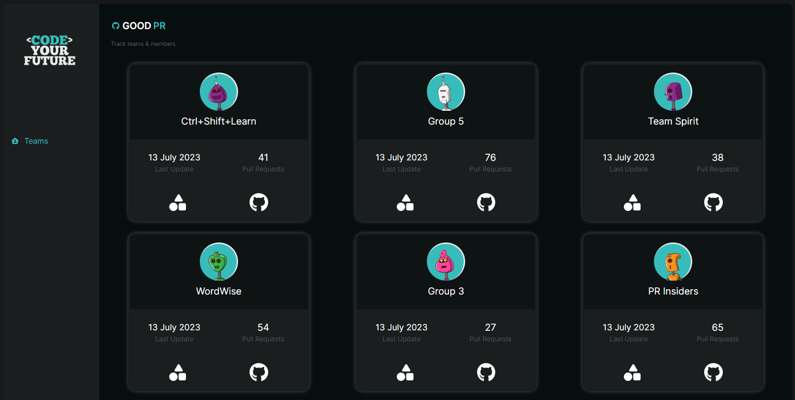
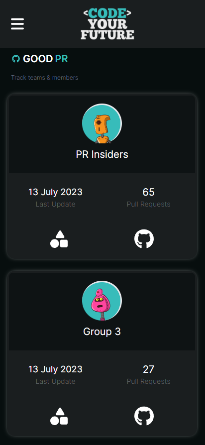
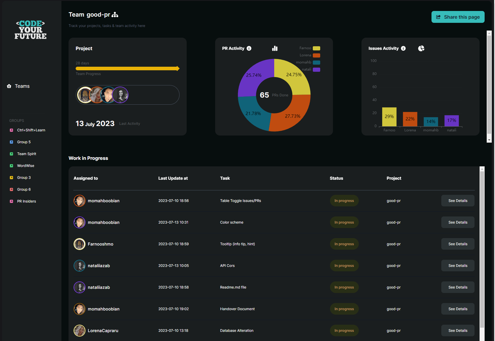
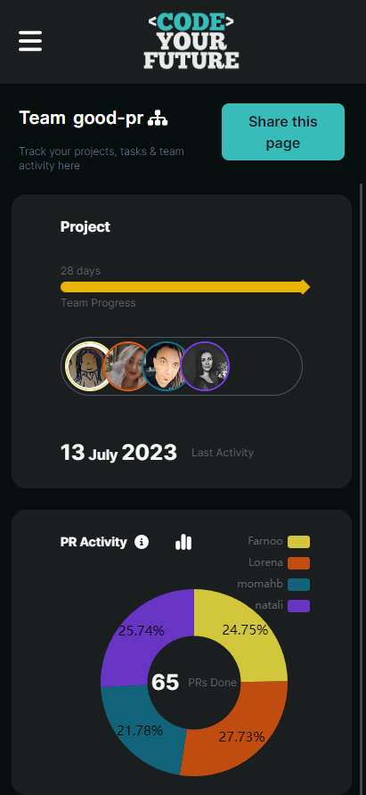
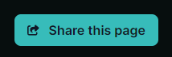
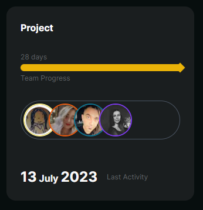
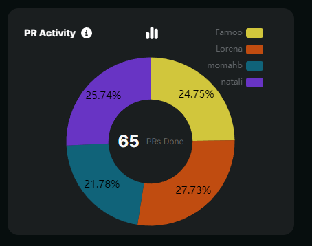
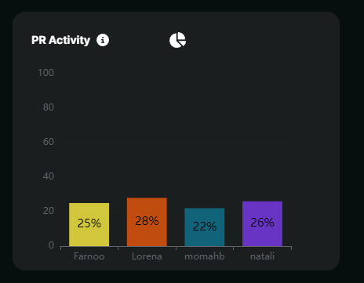
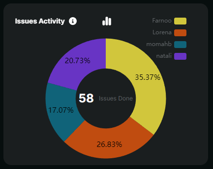
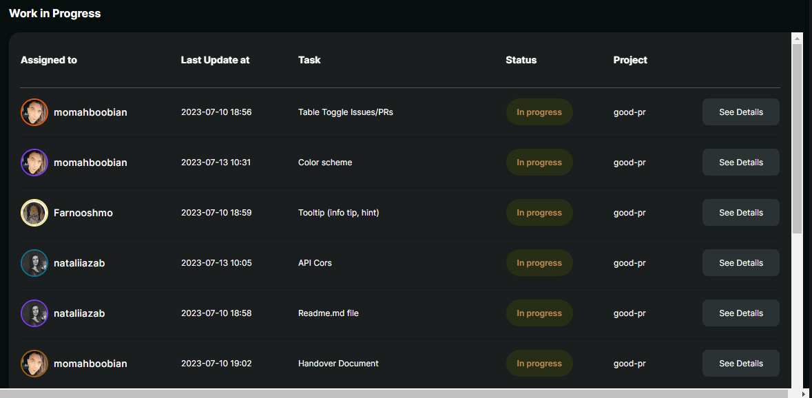

<h1 align="center"> Good PR App </h1> <br>
<p align="center">
  <a href="https://good-pr.vercel.app/">
    
  </a>
</p>

<p align="center">
  Track GitHub activity & ensure fair contributions
</p>

<!-- START doctoc generated TOC please keep comment here to allow auto update -->
<!-- DON'T EDIT THIS SECTION, INSTEAD RE-RUN doctoc TO UPDATE -->

## Table of Contents

- [Introduction](#introduction)
- [Deployed on Vercel](#deployed-on-vercel)
- [Features](#features)
- [Getting Started](#getting-started)
- [Development Keys](#development-keys)
- [Tech Stack](#tech-stack)
- [Dependencies](#dependancies)
- [Feedback](#feedback)
- [Contributors](#contributors)

<!-- END doctoc generated TOC please keep comment here to allow auto update -->

## Introduction

The Good PR App is a web application developed using Next.js, Prisma and Tailwind CSS. The app designed to provide users with a clear visualization of the progress and activity of Code Your Future (CYF) trainees' final projects on GitHub.

Currently, at Code Your Future, it is essential to ensure that every trainee's contribution to the final project is equal. However, there is a lack of a centralized platform that offers a comprehensive visualization of the progress and activity based on the pull requests and issues completed in the project.

The Good PR App serves as a centralized platform that empowers both trainees and mentors to effortlessly track project progress, visualize GitHub activity, and guarantee fair contributions from all team members. It enables a transparent and efficient monitoring system for the final projects, ensuring equal participation and effective collaboration among the team.

## Deployed on Vercel

The app is deployed on the Vercel Platform. You can access it at https://good-pr.vercel.app/

Our app relies on the Prisma database technology, integrated seamlessly with Vercel. Prisma offers a powerful and efficient way to manage the app's data storage and retrieval. With Prisma, we ensure the app performs optimally, providing a smooth and reliable user experience.


## Features

### Homepage

<div style="display: flex; justify-content: space-between;">
  
  
</div>

The homepage of our website displays all the teams from our database. Currently, we have information for the London 9, Round 2 group, but we will be adding more groups from future cohorts.

### Team Dashboard

<div style="display: flex; justify-content: space-between;">
  
  
</div>

The team dashboard provides information for each team, including the last update of their repository, the number of pull requests, a link to the live project demo, and a link to the GitHub repository. Each card is clickable and leads to a dashboard specific to the team, using a query parameter with the group ID.

### Share Button

<p align="center">
  
</p>

The dashboard features a share button that allows users to easily copy the link to the current page and share it with others.

### Project Card

<p align="center">
  
</p>

The project card displays the number of days the team has been working on the project, GitHub photos of contributors, and the last update to the repository.

### PR Activity Card

<div style="display: flex; justify-content: space-between;">
  
  
</div>

The PR Activity card visualizes the number of pull requests for the repository and the contribution percentage of each team member to the total PR count. Hovering over the percentage reveals the specific number of pull requests. The view can be toggled between a pie chart and a bar chart by clicking the central button.

### Issues Activity Card

<div style="display: flex; justify-content: space-between;">
  
  
</div>

The Issues Activity card displays the number of closed issues for the repository by each team member. By clicking the central button, the view can be switched between a bar chart and a pie chart, showing either the total number of issues.

### Work in Progress

<p align="center">
  
</p>

The "Work in Progress" section provides information on the tasks currently being worked on. This data is retrieved from the open issues in the repository. The table presents the last 30 tickets, including the assignee's photo and username, the last update to the issue, the task's name, and a link to the project.


## Getting Started

To use the app, follow these steps:

1. Clone the repository.
2. Install the dependencies by running npm install or yarn install.
3. Start the development server by running

```bash
npm run dev
# or
yarn dev
# or
pnpm dev
```

4. Open http://localhost:3000 in your browser to access the app.

For more information, refer to the Next.js documentation [https://nextjs.org/docs] and the Learn Next.js tutorial [https://nextjs.org/learn].

## Development Keys

The following keys are essential for developing your Next.js app:

### GITHUB_AUTH_TOKEN

- **Description**: This token authenticates your Next.js app with the GitHub API, allowing authorized requests on behalf of a user or an application. Generate a GitHub authentication token and set it as an environment variable in your app's configuration. Ensure the token has appropriate permissions for your app's required actions.

### PostgreSQL Configuration

To connect your Next.js app with a PostgreSQL database, you need to provide the following configuration keys:

- **POSTGRES_URL**:

  - Description: The URL or connection string for your PostgreSQL database.

- **POSTGRES_PRISMA_URL**:

  - Description: The Prisma connection URL for your PostgreSQL database (if using Prisma as your ORM).

- **POSTGRES_URL_NON_POOLING**:

  - Description: An alternative connection URL for non-pooling connections (if necessary).

- **POSTGRES_USER**:

  - Description: The username or role used for authentication and accessing the PostgreSQL database.

- **POSTGRES_HOST**:

  - Description: The hostname or IP address where the PostgreSQL database is hosted.

- **POSTGRES_PASSWORD**:

  - Description: The password associated with the username or role for authentication and access to the PostgreSQL database.

- **POSTGRES_DATABASE**:
  - Description: The name of the PostgreSQL database you want to connect to.

You can set these configuration keys as environment variables in your development environment or provide them through a configuration file, depending on your deployment setup. Ensure that your app's environment is properly configured to establish a successful connection to your PostgreSQL database.

## Tech Stack
The app is built using the following technologies:

Next.js: A React framework for server-rendered applications.
Prisma: A database toolkit for working with databases in a type-safe and efficient way.
Tailwind CSS: A utility-first CSS framework for quickly building custom user interfaces.

## Dependencies
The app relies on the following dependencies:

@fortawesome/fontawesome-svg-core: Version 6.4.0
@fortawesome/free-brands-svg-icons: Version 6.4.0
@fortawesome/free-solid-svg-icons: Version 6.4.0
@fortawesome/react-fontawesome: Version 0.2.0
@octokit/rest: Version 19.0.13
@vercel/og: Version 0.5.8 
axios: Version 1.4.0
chart.js: Version 4.3.0
echarts: Version 5.4.2
echarts-for-react: Version 3.0.2
eslint: Version 8.42.0
express: Version 4.18.2
node-fetch: Version 3.3.1
react: Version 18.2.0
react-dom: Version 18.2.0
react-icons: Version 4.9.0

## Feedback

Feel free to send us feedback via the [Google form](https://docs.google.com/forms/d/e/1FAIpQLSd_Q8_llvch14xjipujB3itm286Ls_RhVpY9ibW8FoFXiluTg/viewform). Feature requests are always welcome.

If there's anything you'd like to chat about, please feel free to contact us on LinkedIn!

## Contributors

#### This project is developed by the following Full Stack Developers:

1. Natalie Zablotska - [Link](https://www.linkedin.com/in/nataliia-zablotska/)
2. Lorena Capraru - [Link](https://www.linkedin.com/in/lorena-capraru/)
3. Farnoosh Moayeri - [Link](https://www.linkedin.com/in/farnooshmoayeri/)
4. Mo Mahboobian - [Link](https://www.linkedin.com/in/mo-mahboobian-08188271/)